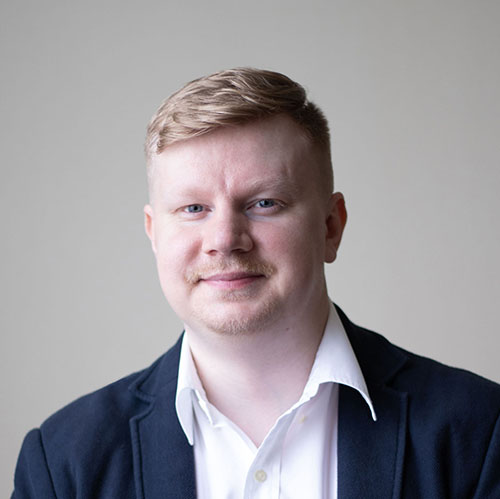

### 👋🏻 Hi there

I'm Andrey, a software engineer (and sometimes an engineering manager) currently living in
Moscow, Russia, or UTC+3 for short.

My main areas of interest include: distributed systems, data processing, applied ML,
and blockchain.

When I'm away from a screen and a keyboard, I enjoy spending time with my family and friends,
traveling, reading non-tech books, and exploring new things. I dislike any form of discrimination,
loud places, and really hot food.

More about me:

💼 [Linkedin](https://linkedin.com/in/akrisanov/) 
🐙 [Github](https://github.com/akrisanov) 
📝 [Блог на русском](https://teletype.in/@akrisanov) 

