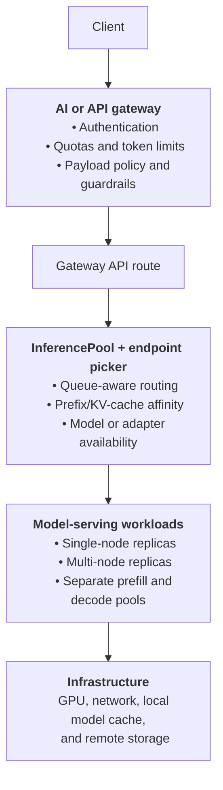
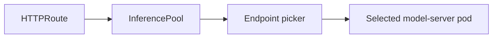
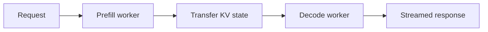

+++
title = "Kubernetes Model Serving in 2026: What Changed Since 2024"
description = "An update on OCI model volumes, inference-aware routing, KServe, llm-d, multi-node inference, GPU scheduling, and the remaining gaps."
date = 2026-07-26
draft = false

[taxonomies]
tags = ["kubernetes", "llm-inference", "ai-infrastructure", "gpu", "gateway-api"]

[extra]
keywords = "kubernetes, model serving, llm inference, kserve, llm-d, gateway api inference extension, leaderworkerset, dynamic resource allocation, gpu scheduling"
toc = true

+++

In October 2024, [Yuan Tang](https://www.linkedin.com/in/terrytangyuan/) published
[AI/ML Innovation in the Kubernetes Ecosystem](https://terrytangyuan.github.io/2024/10/22/ai-ml-innovation-in-the-kubernetes-ecosystem/).
The article described three important developments: Kubeflow Model Registry, KServe ModelCars, and TrustyAI.
It also pointed toward multi-node serving, inference-aware gateways, speculative decoding, LoRA adapters, and
GenAI-specific APIs.

The article was directionally right. But the most important change since then is larger than the progress of any
single project:


Kubernetes model serving is becoming a stack of specialized, composable control-plane and data-plane components.


Kubernetes now has better primitives for distributing model files and allocating accelerators. Gateway API has
gained inference-aware extensions. KServe has introduced a separate API for generative inference. `LeaderWorkerSet`
has become a building block for multi-node model servers, while [llm-d](https://github.com/llm-d/llm-d/) coordinates
routing and distributed inference optimizations around engines such as [vLLM](https://vllm.ai/).

At the same time, the ecosystem is not simpler. The new capabilities solve real problems, but they also introduce
more controllers, APIs, compatibility constraints, and failure modes.


This article covers Kubernetes 1.36, KServe 0.18, the generally available Gateway API Inference Extension,
and related production model-serving projects. The ecosystem evolves quickly, so verify version compatibility
before adopting a particular combination.


## TL;DR

- **OCI model volumes became a native Kubernetes feature.** The read-only OCI volume source introduced as alpha in
  Kubernetes 1.31 graduated to stable in Kubernetes 1.36.
- **[KServe](https://kserve.github.io/website/) split predictive and generative serving.** `InferenceService` remains
  the general predictive-serving API, while `LLMInferenceService` targets LLM-specific routing and distributed execution.
- **Inference-aware routing became a standard concern.** [Gateway API Inference Extension](https://gateway-api-inference-extension.sigs.k8s.io/concepts/api-overview/)
  provides `InferencePool` and an endpoint-selection pattern instead of treating model replicas like interchangeable HTTP servers.
- **Multi-node and disaggregated inference became first-class deployment patterns.** [LeaderWorkerSet](https://lws.sigs.k8s.io/docs/overview/),
  KServe, and llm-d can represent model shards, prefill workers, decode workers, and intelligent routing between them.
- **GPU allocation improved in upstream Kubernetes.** The core of [Dynamic Resource Allocation](https://kubernetes.io/docs/concepts/scheduling-eviction/dynamic-resource-allocation/) is stable, although production readiness still depends on accelerator drivers and cluster integration.
- **Some important features are still early.** [Native workload-aware scheduling](https://kubernetes.io/blog/2025/12/29/kubernetes-v1-35-introducing-workload-aware-scheduling/) is alpha, [Kubeflow Hub](https://www.kubeflow.org/docs/components/hub/) remains an
  opt-in alpha component, and advanced distributed inference still requires careful networking and capacity work.
- **The right production stack is usually smaller than the full ecosystem.** Add components only when a measured
  bottleneck justifies them.

<nav class="article-decision-guide" aria-label="Deployment guidance">
  <span class="article-decision-guide-label">Choose a deployment:</span>
  <a href="#case-1-one-model-one-or-a-few-replicas">Single model</a>
  <a href="#case-2-a-shared-production-llm-service">Shared LLM service</a>
  <a href="#case-3-models-that-require-several-nodes">Multi-node model</a>
  <a href="#case-4-large-scale-or-heterogeneous-inference">Heterogeneous inference</a>
</nav>

## From isolated features to an inference stack

The 2024 view centered on several individual improvements. By 2026, those features fit into a more explicit
architecture:

| Concern | Typical approach in 2024 | State in 2026 |
| --- | --- | --- |
| Model distribution | Object storage, init containers, KServe ModelCars | Native OCI image volumes are stable; node-local model caches remain useful |
| Serving API | Mostly `InferenceService` and engine-specific manifests | `InferenceService` for predictive AI; `LLMInferenceService` for GenAI |
| Request routing | Service-level or round-robin load balancing | `InferencePool` plus inference-aware endpoint selection |
| Large-model execution | Custom multi-node deployments, often tied to Ray | LeaderWorkerSet-backed multi-node deployments and engine-native distributed modes |
| Prefill and decode | Usually colocated in the same replicas | Optional prefill/decode disaggregation with specialized pools |
| Accelerator allocation | Device Plugins and extended resources | Stable DRA core, with driver-dependent adoption |
| Group scheduling | External batch schedulers or custom operators | Native workload-aware scheduling exists, but remains alpha |
| Model metadata | Early Kubeflow Model Registry | Kubeflow Hub combines registry and federated catalog capabilities |
| AI traffic policy | Product-specific gateways and middleware | A Kubernetes AI Gateway Working Group is standardizing common patterns |

Not every row is "solved." What has changed is that the ecosystem now treats inference as a distributed-systems
problem with its own operational concerns.



<p class="mermaid-caption">Figure 1. A production inference request crosses several independently operated layers.</p>

KServe can manage much of this control plane. Gateway API Inference Extension defines the routing integration.
`LeaderWorkerSet` represents groups of pods that must operate together. `llm-d` provides distributed inference and
routing components. Engines such as vLLM or SGLang still execute the model.

These layers overlap, but they are not interchangeable.

## 1. OCI volumes removed the original Kubernetes limitation behind ModelCars

The 2024 article explained why KServe introduced ModelCars: a model could be packaged into an OCI image and exposed
to the model server through a passive sidecar. This reused container-registry distribution and node caching instead
of downloading weights from object storage for every replica.

At that time, Kubernetes could pull an image but could not directly mount its filesystem as a volume. Kubernetes
1.31 introduced the `image` volume source as alpha. Kubernetes 1.33 promoted it to beta, and
[Kubernetes 1.36 made OCI artifact and image volumes stable](https://kubernetes.io/blog/2026/04/22/kubernetes-v1-36-release/).

A pod can now mount read-only content directly from an OCI registry:

```yaml
apiVersion: v1
kind: Pod
metadata:
  name: model-server
spec:
  containers:
    - name: server
      image: example.com/model-server:v1
      volumeMounts:
        - name: model
          mountPath: /models/llama
          readOnly: true
  volumes:
    - name: model
      image:
        reference: registry.example.com/models/llama:2026-07
        pullPolicy: IfNotPresent
```

This changes the ModelCar trade-off. The sidecar pattern is no longer required merely because Kubernetes lacks an
OCI-backed volume type. ModelCars can still be useful for KServe integration, compatibility with older clusters,
and established tooling, but native image volumes provide a cleaner upstream primitive.

However, OCI packaging does **not** eliminate the cold-start problem.

A 100–500 GB model still has to reach the node. Startup behavior still depends on:

- registry throughput and rate limits
- layer structure and decompression cost
- container-runtime support
- node disk capacity and eviction policy
- whether the model is already cached
- how many nodes pull the same model at once

This is why KServe also maintains a
[Local Model Cache](https://kserve.github.io/website/docs/model-serving/generative-inference/modelcache/localmodel).
It can pre-download model artifacts to local NVMe and let several inference pods reuse the warmed copy.

Native OCI volumes improve packaging and delivery semantics. Local caching addresses placement and startup
latency. They solve related but different problems.

## 2. Inference-aware routing became an ecosystem API

A Kubernetes `Service` assumes that its ready endpoints are roughly interchangeable. That assumption breaks down
for LLM serving.

Two healthy replicas can have very different costs for the same request:

- one replica may already have the prompt prefix in its KV cache
- one may have a long queue
- one may be close to KV-cache exhaustion
- only one may have the requested LoRA adapter loaded
- replicas may use different accelerators or quantizations
- a long prompt may be better assigned to a different pool than a decode-heavy request

Round-robin routing ignores all of this.

The same problem space described as "LLM Instance Gateway" in the 2024 article is now addressed by the
[Gateway API Inference Extension](https://gateway-api-inference-extension.sigs.k8s.io/).
By July 2026, the project marks itself generally available and defines `InferencePool` as a specialized backend
abstraction for model servers. A gateway delegates endpoint choice to an inference router or endpoint picker, which can use live metrics
and model-server capabilities.

The request path becomes:



<p class="mermaid-caption">Figure 2. Gateway API delegates model-server selection to an inference-aware endpoint picker.</p>

This is an important separation of responsibilities:

- **Gateway API** handles traffic attachment and routing integration.
- **InferencePool** identifies a pool of inference endpoints.
- **The endpoint picker** decides which endpoint is best for the request.
- **The model server** exposes metrics and capabilities used by the picker.

The reference project deliberately avoids owning every scheduling policy. Its documentation points users
toward components such as the [llm-d router](https://github.com/llm-d/llm-d-router). Some of the advanced features that were
previously developed in the Inference Extension repository have now moved to the llm-d repositories. These features
include more advanced endpoint selection and model rewrite logic. However, the extension will still own the Pool API
and conformance work.

That boundary is healthy. A stable integration API should explain how a gateway connects to an inference pool without
requiring all platforms to use the same scheduling algorithm. The GA label does not imply that every endpoint-selection
policy or gateway implementation is equally mature.

## 3. KServe introduced a GenAI-specific control plane

KServe's original `InferenceService` API was designed for a broad range of predictive models and serving runtimes.
It still fits many workloads well.

LLM serving, however, needs concepts that do not map cleanly to a conventional stateless model endpoint:

- tensor, data, and expert parallelism
- groups of pods forming one logical replica
- prefill/decode disaggregation
- KV-cache-aware routing
- LoRA adapter selection
- long-lived streaming responses
- autoscaling signals based on queues, tokens, and cache pressure

KServe 0.17 presented `LLMInferenceService` as its production-oriented GenAI API. KServe 0.18 added multi-node
inference without requiring Ray, LeaderWorkerSet-based autoscaling, OpenAI Responses API routing, namespace-scoped
model-cache work, and llm-d 0.6 integration.

Production readiness and API stability are not the same thing. In KServe 0.18, example manifests still use the
`serving.kserve.io/v1alpha2` API. Schema evolution therefore belongs in the upgrade plan.

The distinction is now explicit:

- use **`InferenceService`** for predictive AI and simpler serving patterns
- use **`LLMInferenceService`** when you need GenAI-specific orchestration

A simplified resource can describe the model, replicas, runtime, and managed routing:

```yaml
apiVersion: serving.kserve.io/v1alpha2
kind: LLMInferenceService
metadata:
  name: my-llm
spec:
  model:
    uri: hf://organization/model
    name: organization--model
  replicas: 3
  template:
    containers:
      - name: main
        image: vllm/vllm-openai:<tested-version>
        resources:
          limits:
            nvidia.com/gpu: "1"
  router:
    gateway:
      managed: {}
    route:
      httpRoute: {}
    scheduler:
      pool: {}
```

For multi-node execution, adding a worker template causes KServe to create a `LeaderWorkerSet`. Adding a prefill
template selects a disaggregated topology.

This is powerful, but it is not free abstraction.

The complete setup may require Kubernetes 1.32 or newer, Gateway API, an inference-extension-compatible gateway,
Gateway API Inference Extension, `LeaderWorkerSet` for multi-node workloads, [KEDA](https://keda.sh/) for some
autoscaling configurations, cert-manager, KServe, an inference router, and a supported model engine.

That is a serious dependency graph. Before adopting it, validate:

1. the exact compatibility matrix
2. upgrade order and rollback behavior
3. CRD conversion and deletion behavior
4. which component owns each metric and status condition
5. failure handling when the router, gateway, or one worker group is unavailable

`LLMInferenceService` reduces the amount of custom platform code you need to write. It does not remove the need to
operate the resulting distributed system.

## 4. Multi-node inference is now a first-class deployment pattern

Some models do not fit on one node. Others technically fit but need several nodes to reach the required throughput.
A normal `Deployment` is a poor representation of this topology because several pods may jointly form one model
replica and must start, stop, and recover as a group.

[LeaderWorkerSet](https://lws.sigs.k8s.io/docs/overview/) provides an API for deploying a group of pods as a unit of
replication. It targets multi-host AI/ML workloads where a model is sharded across devices and nodes.

KServe can use LeaderWorkerSet for:

- multi-node tensor parallelism
- distributed data parallel replicas
- expert parallelism for mixture-of-experts models
- coordinated lifecycle and autoscaling of worker groups

llm-d builds a higher-level distributed inference system around engines such as vLLM. Its current architecture
includes prefix-cache-aware routing, prefill/decode disaggregation, distributed KV-cache capabilities, multi-node
execution, and workload-aware autoscaling. The project entered the CNCF Sandbox in March 2026.

### Prefill/decode disaggregation

LLM inference has two phases with different resource profiles:

- **Prefill** processes the input prompt. It is often compute-heavy, especially for long contexts.
- **Decode** generates tokens iteratively. It is commonly limited by memory bandwidth and KV-cache access.

A disaggregated architecture runs these phases in different pools and scales them independently:



<p class="mermaid-caption">Figure 3. Disaggregation introduces an explicit KV-state transfer between prefill and decode.</p>

This can reduce interference between long prefills and active decodes, and it can let each phase use a different
replica count or hardware shape.

But it also adds a KV-transfer path before the first token. The result depends heavily on network bandwidth,
latency, topology, transfer libraries, and the workload's prompt/output distribution. On a weak inter-node network,
disaggregation can move the bottleneck rather than remove it.

Use it after measurement, not because the architecture diagram looks advanced.

## 5. Accelerator scheduling improved, but adoption remains driver-dependent

For years, most Kubernetes GPU workloads have requested extended resources exposed by Device Plugins:

```yaml
resources:
  limits:
    nvidia.com/gpu: "8"
```

This works, but it expresses little about the requested devices. It does not naturally represent properties such as
GPU model, memory size, interconnect topology, sharing mode, or a reusable claim.

[Dynamic Resource Allocation](https://kubernetes.io/docs/concepts/scheduling-eviction/dynamic-resource-allocation/)
provides a richer model based on resources such as `DeviceClass`, `ResourceClaim`, and `ResourceClaimTemplate`.
The core DRA APIs graduated to stable in Kubernetes 1.34. Kubernetes 1.36 continued work on device health,
partitionable devices, consumable capacity, and additional drivers.

DRA is the long-term Kubernetes direction for specialized hardware, but “the API is stable” does not mean every
accelerator stack is ready for every production cluster.

You still need to check:

- whether your vendor provides a supported DRA driver
- which Kubernetes and driver versions are compatible
- how MIG, time slicing, or other partitioning modes are represented
- whether device health reaches the controllers that perform recovery
- how upgrades coexist with existing Device Plugin workloads
- whether your managed Kubernetes provider exposes the required features

For many current clusters, Device Plugins remain the pragmatic production default. DRA becomes compelling when its
richer selection and sharing semantics solve a concrete placement problem.

## 6. Kubernetes gained workload-aware scheduling—but it is still early

Distributed inference may require several pods and devices to become available together. Scheduling them one at a
time can leave partially allocated workloads holding scarce GPUs while waiting for the rest of the group.

Kubernetes 1.35 introduced native workload-aware scheduling work, including gang-scheduling foundations.
Kubernetes 1.36 expanded it with `Workload` and `PodGroup` APIs and atomic scheduling of related pod groups.

The important maturity label is **alpha**.

This work is promising because it moves group scheduling closer to the upstream scheduler and Job controller.
It may eventually reduce the need for some external scheduling layers. It is not yet a reason to replace a proven
production scheduler or queueing system without extensive testing.

LeaderWorkerSet and workload-aware scheduling also solve different concerns:

- LeaderWorkerSet describes and manages a replicated group of cooperating pods.
- Workload-aware scheduling determines how related pods receive resources together.

A platform may eventually use both.

## 7. Kubeflow Model Registry became Kubeflow Hub

The Model Registry described in 2024 has expanded into
[Kubeflow Hub](https://www.kubeflow.org/docs/components/hub/), which combines:

- **Model Registry:** metadata, versions, artifacts, lifecycle status, and governance
- **Model Catalog:** read-only discovery across configured external catalogs

The catalog can federate metadata from sources such as Hugging Face. The registry can integrate with deployment
workflows and KServe storage initialization.

The boundary is important: Kubeflow Hub is primarily a metadata and discovery system. Its architecture documentation
explicitly describes the registry as a passive repository rather than a Kubernetes control plane. The catalog does
not store model weights.

As of July 2026, the registry is still offered as an opt-in alpha component in Kubeflow Community Distribution 1.9
and newer, and its REST API remains versioned as `v1alpha3`.

That does not make it useless. It means you should treat it as an early lifecycle component rather than a universal
standard that every inference request depends on.

Keep large weight distribution in OCI registries, object storage, or a dedicated model-cache layer. Keep approval,
lineage, versions, and deployment metadata in the registry.

## 8. Safety and policy are moving toward the gateway plane

TrustyAI has continued beyond its early explainability focus, with tools for metrics, evaluation, bias and drift
analysis, and language-model testing. It remains a pluggable part of the wider lifecycle rather than the central
serving control plane.

A newer development is the formation of the
[Kubernetes AI Gateway Working Group](https://kubernetes.io/blog/2026/03/09/announcing-ai-gateway-wg/).
Its scope includes common patterns such as:

- token-based rate limiting
- fine-grained access control
- payload inspection
- routing, caching, and guardrail hooks
- secure access to external model providers
- regional policy and failover

This is a useful architectural direction. Model-serving engines should concentrate on scheduling and executing
inference. Cross-cutting tenant policy belongs closer to the gateway, where both self-hosted and external providers
can be governed consistently.

The working group is new, so its proposals should not be confused with stable APIs already implemented everywhere.

## What I would deploy today

There is no single "Kubernetes AI stack." I would choose the smallest architecture that can handle the workload.

### Case 1: One model, one or a few replicas

Start with:

- a tested model-server image, such as vLLM, SGLang, or TensorRT-LLM
- a `Deployment`, `StatefulSet`, or a basic KServe `InferenceService`
- a standard `Service` and Gateway API route
- model files from object storage, an OCI image volume, or a pre-warmed node cache
- Prometheus metrics at the gateway, engine, GPU, and node layers

Do not install an inference-aware router until replicas are sufficiently busy for routing quality to matter.

### Case 2: A shared production LLM service

Add:

- multiple replicas with an explicit latency and throughput SLO
- `InferencePool` and a production endpoint picker when queue or cache affinity matters
- KServe `LLMInferenceService` when its lifecycle automation is worth the dependencies
- request priorities, admission control, quotas, and maximum context/output limits
- autoscaling based on queueing and workload shape—not GPU utilization alone

Keep the model server and routing policy independently observable. A healthy gateway does not prove that the engine
is healthy, and a healthy engine does not prove that clients receive timely streamed tokens.

### Case 3: Models that require several nodes

Add `LeaderWorkerSet` only when one logical replica spans multiple pods or nodes.

Before production, test:

- startup and restart of the whole worker group
- one worker or node failing during generation
- collective-communication failures
- rack and topology placement
- network saturation
- rolling updates when old and new model copies cannot fit simultaneously
- whether failed replicas release all GPUs promptly

*The network is part of the inference computer. Treat it as capacity, not plumbing.*

### Case 4: Large-scale or heterogeneous inference

Evaluate DRA when you need richer accelerator selection, sharing, or health semantics and your vendor's driver is
ready. Consider llm-d when prefix affinity, prefill/decode disaggregation, or distributed serving produces a
measurable improvement over simpler routing.

Do not adopt every available CRD. Every controller adds:

- reconciliation behavior
- status you must monitor
- upgrade compatibility
- RBAC and security surface
- another place where desired and actual state can diverge

Platform maturity is not measured by the number of operators installed.

## What is still not solved

The ecosystem has advanced quickly, but several difficult problems remain.

### Predictable cold starts

OCI volumes and local caches improve delivery, but very large models still require substantial disk, network, and
initialization time. Autoscaling cannot create warm GPU capacity instantly.

### Safe autoscaling

Inference demand is measured in prompts, tokens, context lengths, and active sequences—not only requests per second.
Replica startup may take many minutes, and scaling down can interrupt streams or destroy useful cache state.

### Portable accelerator management

DRA provides a stable upstream API, but production behavior still depends on vendor drivers, managed-platform
support, partitioning features, and integration with the existing device stack.

### Operational simplicity

A full GenAI deployment may combine KServe, Gateway API, Inference Extension, a gateway implementation,
LeaderWorkerSet, KEDA, llm-d components, an engine, a model cache, and accelerator drivers. Compatibility testing is
part of the product.

### Distributed-inference networking

Tensor parallelism, expert parallelism, and KV transfer are sensitive to topology and bandwidth. Kubernetes can
place and restart pods, but it cannot compensate for an under-designed network.

### Stable common APIs

The ecosystem has clearer boundaries than it did in 2024, but several APIs remain alpha or project-specific.
Expect more movement before the higher-level interfaces settle.

## Final perspective

In 2024, Yuan Tang identified several important areas of focus for the tech industry: model distribution,
model management, responsible AI, inference gateways, and multi-node serving.

What changed is that these ideas are no longer a loose roadmap. They are becoming distinct layers:

- Kubernetes provides model-volume and device-allocation primitives.
- Gateway API provides the integration point for inference-aware routing.
- KServe provides model-serving control planes.
- LeaderWorkerSet represents cooperating multi-pod replicas.
- llm-d coordinates distributed inference optimizations around model engines.
- Kubeflow Hub manages model metadata and discovery.
- AI gateways are becoming the policy boundary.

This does not mean Kubernetes makes inference fast by itself.

Performance still comes from the model engine, kernels, quantization, batching, KV-cache management, accelerator
topology, and workload shape. Kubernetes provides the control, placement, lifecycle, and routing abstractions needed
to operate those optimizations as a reliable platform.

The practical lesson is simple:


Build the smallest serving stack that meets today's SLOs, and add inference-specific layers only when data shows
that the simpler architecture has reached its limit.


## Sources and further reading



- [AI/ML Innovation in the Kubernetes Ecosystem (2024)](https://terrytangyuan.github.io/2024/10/22/ai-ml-innovation-in-the-kubernetes-ecosystem/)
  <span class="further-reading-description">The original ecosystem overview revisited by this article.</span>
- [Kubernetes 1.36 release notes](https://kubernetes.io/blog/2026/04/22/kubernetes-v1-36-release/)
  <span class="further-reading-description">Upstream changes including stable OCI image volumes.</span>
- [Gateway API Inference Extension](https://gateway-api-inference-extension.sigs.k8s.io/)
  <span class="further-reading-description">API definitions and concepts for inference-aware routing.</span>
- [KServe 0.18 release](https://kserve.github.io/website/blog/kserve-0.18-release)
  <span class="further-reading-description">Generative inference and model-serving control-plane changes.</span>
- [KServe LLMInferenceService overview](https://kserve.github.io/website/docs/model-serving/generative-inference/llmisvc/llmisvc-overview)
  <span class="further-reading-description">The GenAI-specific serving API and its architecture.</span>
- [LeaderWorkerSet overview](https://lws.sigs.k8s.io/docs/overview/)
  <span class="further-reading-description">A Kubernetes API for groups of cooperating pods.</span>
- [llm-d documentation](https://llm-d.ai/docs/0.7)
  <span class="further-reading-description">Distributed inference, routing, and disaggregation components.</span>
- [Kubernetes Dynamic Resource Allocation](https://kubernetes.io/docs/concepts/scheduling-eviction/dynamic-resource-allocation/)
  <span class="further-reading-description">The upstream resource-allocation model used by accelerator drivers.</span>
- [Kubeflow Hub](https://www.kubeflow.org/docs/components/hub/)
  <span class="further-reading-description">Model registry and federated catalog capabilities.</span>
- [Kubernetes AI Gateway Working Group](https://kubernetes.io/blog/2026/03/09/announcing-ai-gateway-wg/)
  <span class="further-reading-description">The effort to standardize AI gateway patterns in Kubernetes.</span>

