+++
title = "How to Plan LLM Inference Capacity for a Shared Platform"
description = "Turn product scenarios, workload traces, latency SLOs, and failure requirements into an evidence-based GPU capacity plan."
date = 2026-07-29
draft = false

[taxonomies]
tags = ["llm-inference", "ai-infrastructure", "capacity-planning", "observability", "gpu", "performance"]

[extra]
keywords = "llm inference capacity planning, gpu capacity, vllm benchmarking, ttft, tpot, goodput, multi-tenant inference, llm observability, enterprise"
toc = true

+++

Here's an example of a recurring capacity-planning request for an internal LLM platform inside an enterprise company I'm working on:

> We have selected a model. Do we have enough capacity, and how many GPUs would we need for N users?

The question makes sense, but it's missing some key details.

The model and its serving configuration determine the minimum resources required to start one replica.
They don't tell us how many requests that replica can handle while meeting a product's latency and reliability requirements.
It depends on the workload, like how long the prompts and responses are, how often requests arrive, concurrency,
cache reuse, calls per user task, traffic bursts, and competition with other workloads.


The model determines the footprint of one replica. The workload and service-level objectives determine how many
replicas the product needs.


This guide is meant to help product teams ask better questions about capacity planning for shared LLM inference and
avoid making incorrect assumptions from the start. It's not a GPU calculator, but it gives you a way to replace
guesses with measurements.

## TL;DR

- A registered user isn't a unit of inference load.
- When you start thinking about inference capacity, just separate three questions: the GPU footprint of one replica,
  the sustainable serving capacity of that replica, and the total capacity required by the product.
- Before you start benchmarking, you'll need to define your workload classes and measurable SLOs.
- Take a look at both the application and the inference server. Neither of these views is enough on its own.
- Instead of multiplying the results from a small user test, try benchmarking with representative requests and an open-loop arrival model.
- Size for **goodput**: This is the request rate that the system can handle while meeting latency SLOs.
  It's not the highest raw throughput it can produce.
- On a shared platform, capacity planning also requires things like quotas, admission control, isolation rules, and failure reserve.
  Talk about those with your platform team early on.
- If you make any changes to the model, runtime, prompt, or workload, just run the benchmark again.

## Three different capacity questions

When we talk about capacity, we're often dealing with three different problems at once.

| Question | What it means | Information required |
| --- | --- | --- |
| **Replica footprint** | How many GPUs are required to start one model replica? | Exact checkpoint and revision, precision or quantization, context limit, parallelism strategy, runtime version, and serving configuration |
| **Serving capacity** | How much load can one warm replica sustain within the SLO? | A representative workload, target hardware, request arrival pattern, and load test |
| **Product capacity** | How many replicas and GPUs are required in production? | Peak offered load, SLO, isolation model, growth forecast, failure reserve, and degradation policy |

The first question is mostly about memory and execution topology. The second is a performance experiment.
The third one is about how reliable the product is and how it's planned.

This distinction also explains why a free GPU isn't automatically serving capacity.
Before the platform can handle traffic, it has to do a few things first. First, it has to place a replica,
load the model, allocate its KV cache, warm the runtime, pass readiness checks, and attach it to the request path.
Depending on the model size and how it's set up, this could take *minutes*.
If the startup time is longer than the product can handle during a busy period, reactive autoscaling won't replace warm reserve.

## Why user count is a weak capacity signal

Two requests to the same model can have very different costs:

- a short question with a short answer
- a summarization request with tens of thousands of input tokens
- an agent step containing tool schemas and a long conversation history
- a request that reuses a cached prefix
- a long-running generation that keeps KV-cache blocks active
- a user task that triggers ten LLM calls, several tool calls, retries, and context compaction

Modern inference engines such as vLLM combine requests through continuous batching.
They schedule prompt processing (**prefill**) and token generation (**decode**) while managing a queue and KV cache.
Prefill is usually more compute-intensive, while decode is often constrained by memory bandwidth and the number of active sequences.
Changes in the input-length distribution can increase time to first token without changing the output throughput.
Changes in concurrency or output length can make token streaming take longer and fill up the KV cache.

This is why the following two products may have the same number of users but require very different capacity:

- a chat assistant used a few times per day
- a coding agent that performs many LLM calls for every user task


When it comes to planning for how much your system can handle, it's not about the number of user accounts.
It's basically the workload generated by the product over time.


## Start with workload classes

Before collecting aggregate metrics, describe the operations the product performs. Here are some examples:

| Workload class | Typical shape |
| --- | --- |
| Interactive question answering | Short or medium prompt, short streamed response, latency-sensitive |
| Document summarization | Long prefill, medium output, often asynchronous |
| Structured extraction | Medium prompt, constrained output, potentially high request rate |
| Coding assistant | Repository context, tool definitions, multi-turn interaction |
| Agent task | Multiple LLM calls, tools, retrieval, retries, and context compaction |
| Batch generation | High throughput, less strict per-request latency |

Don't just build your workload on successful demos. Make sure you include things like long tasks, tool failures,
retries, user cancellations, large contexts, and sessions that require compaction. These cases often lead to
tail latency, which is key in determining production capacity.

Model selection and capacity planning are related, but they shouldn't be combined into one step.
External APIs (OpenRouter, OpenAI, etc.) are great for quickly comparing model quality.
But their throughput and latency can't be transferred to a self-hosted deployment.
The final candidates should be benchmarked against the target runtime and hardware.

## Define SLOs before measuring capacity

We can't test «comfortable performance for 500 users.»
It's useful to have requirements that can be measured, and it's best to do that with service-level objectives.

For streaming LLM applications, the main latency signals are:

- **time to first token (TTFT):** how long the user waits before generation begins
- **inter-token latency (ITL):** the gaps between streamed tokens and the pauses a user can notice
- **time per output token (TPOT):** request-level decode time normalized by the number of generated tokens
- **end-to-end request latency:** how long the complete LLM call takes
- **queue time:** how long the request waits before execution
- **task or agent-run duration:** how long the user waits for the complete workflow

Reliability signals matter as well:

- error and timeout rate
- cancellation rate
- model availability
- SLO attainment percentage
- behavior during overload, rollout, and infrastructure failure

The product team should choose target values based on user experience and how important they are to the business.
The platform team can then decide if a certain model configuration can meet their needs.

Raw throughput is not the right optimization target. A server may complete more requests per second while allowing
TTFT or TPOT to become unacceptable. A better concept is **goodput**: the request rate the system can sustain while
meeting the defined latency objectives. The [DistServe paper](https://www.usenix.org/conference/osdi24/presentation/zhong-yinmin)
uses this framing for LLM serving, and current
[vLLM benchmarking tools](https://docs.vllm.ai/en/latest/cli/bench/serve/) can report SLO-constrained goodput.

## Observe the application and the inference platform

Proper capacity planning needs two complementary views.

### Application view

For every LLM call, capture at least:

| Category | Example fields |
| --- | --- |
| Correlation | `project`, `environment`, `session_id`, `run_id`, `llm_call_id`, `trace_id` |
| Model | Requested alias, selected model, model revision |
| Work | Input, output, cached, and reasoning tokens when the runtime exposes them |
| Context | Context length, `max_tokens`, shared-prefix indicator |
| Timing | Request start, first-token time, completion time |
| Execution | Streaming mode, finish reason, status |
| Reliability | Timeout, cancellation, retry, attempt number |
| Scenario | Workload class, agent-loop step, compaction or normal call |

For an agentic application, one LLM call is too small a unit. The main unit should be the **run**: one execution of a user task.
A run should record the number of LLM calls, tool calls, retries, and compactions.
It should also record total token usage, maximum context length, models used, duration, final status, and a quality signal.

A tracing system like [Langfuse](https://langfuse.com/docs/observability/overview) can show LLM calls,
retrieval, tools, and application logic as nested observations. Its data model also lets you group traces into
[sessions](https://langfuse.com/docs/observability/data-model). The specific solution isn't as important as
preserving the causal structure of the task.

### Inference-platform view

The inference layer usually exposes:

- running and waiting requests
- queue-time distribution
- prompt and generated token throughput
- TTFT, ITL, request-level TPOT, and end-to-end latency
- KV-cache usage, reuse, eviction, and preemption
- request failures and runtime errors
- GPU memory, utilization, throttling, and hardware health

You'll want to measure the incoming offered load at the gateway and the completed throughput at the model server.
When there's an overload, the throughput might stay the same, but the queue and the incoming demand will keep growing.
So, when you're looking at just the finished requests, it might make saturation look stable.

For example, [vLLM production metrics](https://docs.vllm.ai/en/latest/usage/metrics/) include queue depth, queue time,
prompt and generation lengths, TTFT, inter-token latency, prefill and decode time, and KV-cache signals.

The application explains **what workload was created**. The inference platform explains **how the serving system
handled it**. Without both views, it is difficult to distinguish between an overloaded model server, unexpectedly
large contexts, excessive calls per agent run, slow tools, retries, or contention with another tenant.

High-cardinality identifiers should be in traces or logs, not in Prometheus labels.
It's important to keep user and business identifiers pseudonymized.

## Preserve workload shape, not only averages

Averages can hide the cases that cause queues and SLO violations. At minimum, analyze:

- requests per second and per minute
- concurrent LLM calls
- active user or agent runs
- input and output tokens over time
- p50, p95, and p99 input length
- p50, p95, and p99 output length
- p95 and p99 total context length
- LLM calls and tokens per run
- cache-hit and shared-prefix behavior
- retry and cancellation rates
- traffic by time of day
- peak-to-average ratio
- expected growth
- model mix

Percentiles are great for dashboards, but you need more than a list of independent percentiles to reconstruct a workload.
The length of the input, the length of the output, the time it arrives, the scenario, and how the cache behaves are all connected.
Make sure you keep a sample of the request metadata that's been cleaned up, or a replayable trace, so that the benchmark can keep track of these relationships.

Arrival patterns matter too. A closed-loop test, in which each virtual user sends a new request only after the
previous one completes, reduces offered load when the server slows down. It can hide overload. For online serving,
prefer an open-loop test that sends requests according to a controlled arrival rate and burstiness. vLLM's serving
benchmark supports request-rate, burstiness, warm-up, detailed per-request output, and timed-trace replay.
[MLPerf's server scenario](https://mlcommons.org/benchmarks/inference-datacenter/) follows the same general principle
by generating independent request arrivals and measuring the maximum rate that stays within a tail-latency constraint.

## A defensible benchmarking process

The following loop should work for a new model or a material workload change.

```mermaid
flowchart LR
    accTitle: The LLM capacity-planning loop
    accDescr: Product scenarios produce application traces. Sanitized traces are replayed against a pinned model configuration. The SLO boundary determines the initial replica count, which is then validated in production and updated with new telemetry.

    Scenarios["Product scenarios"]
    Telemetry["Application telemetry"]
    Replay["Sanitized workload replay"]
    Benchmark["Single-replica benchmark"]
    Boundary["SLO-constrained capacity"]
    Plan["Replica and reserve plan"]
    Production["Production validation"]

    Scenarios --> Telemetry
    Telemetry --> Replay
    Replay --> Benchmark
    Benchmark --> Boundary
    Boundary --> Plan
    Plan --> Production
    Production --> Telemetry
```



<p class="mermaid-caption">Figure 1. Capacity planning is a feedback loop, not a one-time calculation.</p>

### 1. Pin the complete serving configuration

Record:

- model checkpoint and revision
- tokenizer and revision
- precision or quantization
- maximum context length
- tensor, pipeline, expert, and data parallelism
- chat template and reasoning settings
- speculative decoding configuration
- inference runtime and version
- scheduler, batching, and KV-cache settings
- GPU type, count, interconnect, CPU, memory, and software stack

Changing any of these can change memory usage, TTFT, TPOT, throughput, or quality.

### 2. Use the target hardware

Run a warm replica on the same hardware and with the same topology as production. A benchmark on a different GPU,
interconnect, runtime version, or parallelism plan can be useful for comparison, but it's not the final word on sizing.

### 3. Replay representative work

Try to use real, sanitized request metadata when you can. Keep the mix of workload classes, input and output lengths,
arrival times, generation settings, cache reuse, and retries the same. And don't forget to include warm-up requests before collecting results.

Tools such as [vLLM Bench](https://docs.vllm.ai/en/latest/cli/bench/serve/) and
[NVIDIA AIPerf](https://docs.nvidia.com/aiperf/reference/ai-perf-metrics-reference) expose the latency and throughput
metrics needed for this experiment.

### 4. Increase offered load

Increase the request rate a bit at a time. Don't stop when the GPU utilization hits a good number.
Keep going until one or more constraints don't work anymore.

- TTFT or TPOT crosses its target
- queue time grows without recovering
- SLO attainment falls below the target
- errors, timeouts, or cancellations rise
- KV-cache pressure causes preemption or instability

The highest stable rate before these failures is the sustainable capacity of that replica for that workload and SLO.

### 5. Repeat and record variance

Run each important point more than once. Record the benchmark duration, the warm-up plan, the random seed or trace,
and all the info about the configuration. Short tests might miss things like burst behavior, cache churn, thermal throttling, and long-tail requests.

### 6. Validate the full deployment

A single-replica result is just an input to the plan, not the final answer. Run the test again with the right number
of replicas and the actual load-balancing strategy. Scaling might be non-linear due to cache affinity, routing, networking,
distributed execution, and uneven request placement.

Finally, let's cover test failure and maintenance scenarios. This includes things like losing a replica,
losing a GPU node, rollout, rollback, and reduced capacity in another failure domain.

## Turning the benchmark into a capacity plan

To get one stable workload mix, the calculation is pretty simple:

```text
sustainable_load_per_replica =
    highest offered load at which the required SLO attainment is preserved

base_replicas =
    ceil(projected_peak_offered_load / sustainable_load_per_replica)

reserve_replicas =
    capacity needed for failures, rollouts, and near-term growth

planned_replicas =
    base_replicas + reserve_replicas
```

This is just shorthand, not a universal scalar formula. A workload has a lot of different parts: the request rate,
concurrency, input and output lengths, cache reuse, and model mix all need to match the benchmark.
If the product has very different workload classes, you should benchmark the production mix or establish separate
capacity envelopes and admission rules.

The reserve should cover the actual failure topology. If you lose one pod, you could lose a complete multi-GPU replica.
If you lose one node, you might lose a bunch of replicas or even the whole model shard. A rollout might mean that old
and new versions will have to coexist for a while. So, the right reserve depends on placement, model topology,
recovery time, and the product's permitted degradation mode.

## Capacity on a shared platform

A multi-tenant inference platform introduces another variable: **other workloads**.

When a bunch of products use the same replicas, they compete for:

- scheduler and gateway queues
- batching slots
- KV cache
- GPU compute and memory bandwidth
- generated-token throughput

If you can't tell which tenant is using what resources, you can't really figure out how much they're using.
Every project should use a stable project identity and correlation IDs from the gateway to the inference server.

There are three common operating models:

| Model | Characteristics | Suitable for |
| --- | --- | --- |
| **Shared replicas** | Potentially highest utilization, shared queues, quotas and concurrency limits | Small or non-critical workloads |
| **Dedicated replicas** | Separate serving endpoints and queues; GPU nodes may still be shared | Important products with predictable demand |
| **Reserved capacity** | Guaranteed GPU allocation or nodes, dedicated replicas, explicit failover reserve | Critical products with strict SLOs |

You can't get both maximum utilization and an independent SLO for free. Shared platforms need a few things,
like admission control, rate and concurrency limits, tenant quotas, priorities, and an overload policy.
Otherwise, one product can use up the queue and KV cache that every other tenant needs.

The degradation policy should be clear. Here are some options to consider: you could reject excess requests with a retryable error,
restrict maximum context or output length, reduce agent parallelism, route to a smaller model, pause batch traffic, or accept a lower SLO for a defined workload class.

## A practical sizing request

Here's a template for the product team to use when asking the platform team about capacity.

### 1. Product and scenarios

- product or service name
- owner and technical contact
- environments
- workload classes
- interactive, asynchronous, batch, or agentic execution
- expected launch date and growth stages

### 2. Model candidates

- exact model identifiers and revisions
- tokenizer revision
- quality-evaluation results
- context-length requirement
- reasoning, multimodal, tool-calling, or structured-output requirements
- acceptable fallback models

### 3. Workload profile

- expected active users or jobs
- requests or agent runs per time window
- LLM calls per run
- input tokens p50, p95, and p99
- output tokens p50, p95, and p99
- context length p50, p95, and p99
- concurrent LLM calls
- peak-to-average ratio and burst duration
- expected growth over the next 6-12 months
- representative trace or dataset

### 4. SLO

- TTFT target and attainment percentage
- ITL target and attainment percentage
- request-level TPOT target and attainment percentage
- end-to-end LLM latency
- agent-run or job duration
- queue-time limit
- error and timeout rate
- overload behavior

### 5. Reliability and isolation

- shared, dedicated, or reserved capacity
- required availability
- acceptable capacity after a replica, GPU, node, or failure-domain loss
- rollout and rollback requirements
- maximum recovery time
- allowed degradation modes

### 6. Observability and data handling

- tracing system
- token-usage collection
- correlation IDs
- prompt and application versioning
- pseudonymization
- retention and access rules
- confirmation that sensitive prompts, outputs, tool arguments, source code, and documents are not recorded by
  default

If important data is missing, the platform team can only give a preliminary estimate with explicit assumptions and a wide range.

## How to Be Less Wrong When Asking for a Capacity Sizing Estimate

### We will have 400 users

This describes the audience, not the load. Add active-user behavior, scenario frequency, LLM calls per task, token
distributions, concurrency, and peaks.

### The model fits on eight GPUs, so one node is enough

Eight GPUs might be the bare minimum for one replica. It doesn't say how much SLO-compliant traffic the replica can handle or if the product can survive a node failure.

### We tested with 30 users and multiplied the result

LLM inference is non-linear because of batching, queueing, cache pressure, and the distribution of request lengths.
Just control the request rate and replay the workload.

### Average latency is fine

The average hides the long tail. Capacity is usually limited by p95 or p99 latency, queue time, errors, and
the percentage of SLO targets that need to be met. If you're dealing with a low-volume workload, make sure you've
got a long enough measurement window so the tail percentiles have enough observations to be meaningful.

### The external API was fast

External APIs are great for checking the quality of models. We don't know their hardware, batching, routing, or load,
so we can't predict how they'll perform in a local deployment.

### GPU utilization is below 100%, so capacity is available

GPU utilization alone doesn't tell the whole story about queueing, KV-cache pressure, memory headroom, TTFT, TPOT, or the impact of one more long request.

### Our tracing tool will tell us how many GPUs to buy

Application tracing explains the workload. You've got to pair it with benchmarks and inference-server metrics to figure out how much GPU capacity there is.

### We will log everything and investigate later

Capacity planning doesn't usually require storing raw prompts, responses, documents, source code, tool arguments, or terminal output.
Having too much telemetry can create security and privacy risks without actually improving the calculation.

## Capacity planning is a measurement discipline

A useful capacity plan isn't a model-to-GPU lookup table. It connects four things:

1. the product scenarios users actually run
2. the workload those scenarios generate
3. the SLO the product must meet
4. the sustainable capacity measured on the target serving configuration

The process is iterative. Prompts change. Agent loops gain new steps. Contexts grow.
Model revisions and inference engines are subject to change. Traffic is moving from a pilot to production.
Any material change the capacity boundary.

The durable solution is a feedback loop: instrument the product, replay representative work, measure
SLO-constrained capacity, reserve for failures, and compare the plan with production telemetry.

## Further reading



- [vLLM Bench: online serving benchmark](https://docs.vllm.ai/en/latest/cli/bench/serve/)
  <span class="further-reading-description">Reference CLI and metrics for benchmarking an OpenAI-compatible serving endpoint.</span>
- [vLLM production metrics](https://docs.vllm.ai/en/latest/usage/metrics/)
  <span class="further-reading-description">Serving-system signals for latency, queues, token throughput, and KV-cache usage.</span>
- [NVIDIA AIPerf metrics reference](https://docs.nvidia.com/aiperf/reference/ai-perf-metrics-reference)
  <span class="further-reading-description">Definitions for the latency and throughput metrics reported by NVIDIA AIPerf.</span>
- [DistServe: goodput-optimized LLM serving](https://www.usenix.org/conference/osdi24/presentation/zhong-yinmin)
  <span class="further-reading-description">The OSDI paper that frames LLM serving capacity around SLO-constrained goodput.</span>
- [Langfuse observability overview](https://langfuse.com/docs/observability/overview)
  <span class="further-reading-description">Tracing concepts for connecting LLM calls, retrieval, tools, and application logic.</span>
- [Langfuse data model](https://langfuse.com/docs/observability/data-model)
  <span class="further-reading-description">How traces, observations, scores, and sessions represent an application workload.</span>
- [MLPerf inference scenarios and metrics](https://mlcommons.org/benchmarks/inference-datacenter/)
  <span class="further-reading-description">Standard inference scenarios and latency constraints, including open-loop server testing.</span>

